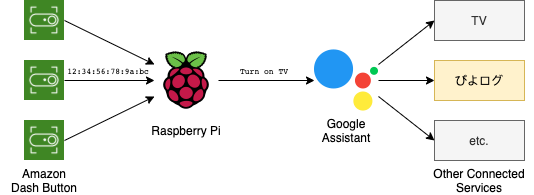

# dash-assistant
Send request to Google Assistant by pushing Amazon Dash Button.



## Preparation
Follow the instruction of Google Assistant SDK.
- [Configure a Developer Project and Account Settings](https://developers.google.com/assistant/sdk/guides/service/python/embed/config-dev-project-and-account)
- [Register the Device Model](https://developers.google.com/assistant/sdk/guides/service/python/embed/register-device)
- [Install SDK and Sample Code](https://developers.google.com/assistant/sdk/guides/service/python/embed/install-sample)
End of the instruction, you would have `DEVICE_MODEL_ID` and `credentials.json`.

Also, you need to install some libraries.
```bash
$ sudo apt install tcpdump
$ pip install -r pi/requirements.txt
```

## Usage
Set the following environment values for Google Assistant.
- `DEVICE_ID`
- `DEVICE_MODEL_ID` Identifier defined by Actions Console
- `CREDENTIALS` Path of `credentials.json`

You can modify [config.py](pi/config.py) directly.

And, please associate your own amazon dash's MAC with Google Assistant request in [dashes.yml](pi/dashes.yml).
```yaml
# example of dashes.yml
actions:
  # "dash's mac address": "text request to Google Assistantr"
  "12:34:56:78:90:AA": "Turn on TV"
  "12:34:56:78:90:BB": "Turn off TV"

```

You can inspect MAC by running [amazon_dash.py](pi/amazon_dash.py) or use other libraries (e.g. [Nekmo/amazon-dash](https://github.com/Nekmo/amazon-dash))

Then, run [main.py](pi/main.py).
```bash
$ sudo -E python3 main.py
Ready to press Amazon Dash Button
2020-06-17 21:32:02,384 - root - INFO - 12:34:56:78:90:AA is pressed.
2020-06-17 21:32:02,391 - root - INFO - Turn on TV
```
